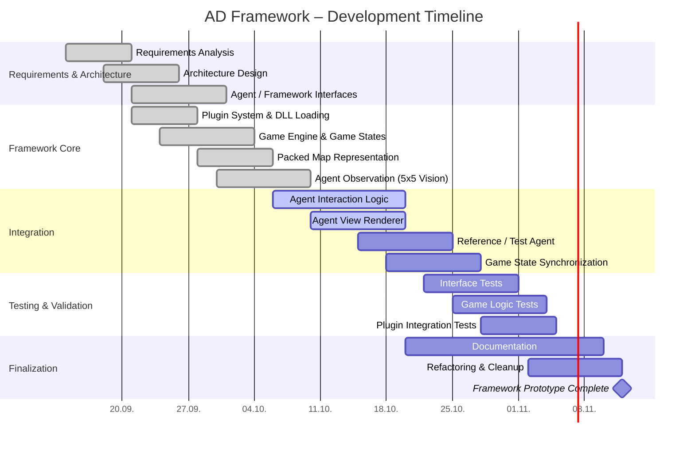

# Diary

## Project Timeline

The following Gantt chart shows the development progress and planned milestones of the AD Framework.

```mermaid
gantt
    title AD Framework – Development Timeline
    dateFormat  YYYY-MM-DD
    axisFormat  %d.%m.

    section Requirements & Architecture
    Requirements Analysis             :done, req,  2026-09-14, 7d
    Architecture Design               :done, arch, 2026-09-18, 8d
    Agent / Framework Interfaces      :done, intf, 2026-09-21, 10d

    section Framework Core
    Plugin System & DLL Loading       :done, plug, 2026-09-21, 7d
    Game Engine & Game States         :done, eng,  2026-09-24, 10d
    Packed Map Representation         :done, map,  2026-09-28, 8d
    Agent Observation (5x5 Vision)    :done, obs,  2026-09-30, 10d

    section Integration
    Agent Interaction Logic           :active, interact, 2026-10-06, 14d
    Agent View Renderer               :active, render, 2026-10-10, 10d
    Reference / Test Agent            :agent, 2026-10-15, 10d
    Game State Synchronization        :sync,  2026-10-18, 10d

    section Testing & Validation
    Interface Tests                   :tests, 2026-10-22, 10d
    Game Logic Tests                  :logic, 2026-10-25, 10d
    Plugin Integration Tests          :ptest, 2026-10-28, 8d

    section Finalization
    Documentation                     :docs, 2026-10-20, 21d
    Refactoring & Cleanup             :clean, 2026-11-02, 10d
    Framework Prototype Complete      :milestone, m1, 2026-11-12, 0d
```