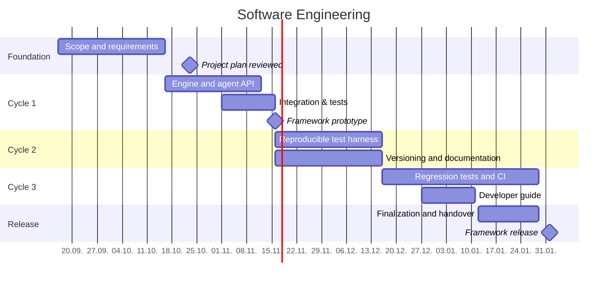
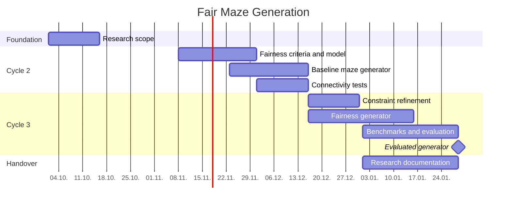

# Diary

# Development Log – AD Framework

**Developer:** Leonard Kämpf
**Project:** AD Framework
**Role:** Framework and Game Engine Development

This document records weekly development activities, technical decisions, problems, and upcoming tasks.

---

## Week 44 (26.10. – 30.10.2026)

### Activities
- Updated the Gantt chart again to reflect the mathematical modeling and two-stage map generation milestones.
- Started with Literature Research for Fair Maze Generation. Paper planned of taking into account are listed below.

### Decisions
- Due to the research findings I decided to go with a two-step maze generator, as **Rupp, F., & Eckert, K. (2025)** stated, that this is the best way so the Optimization of the map will converge

### Open Issues / Next Steps
- Implement the graph-theoretic and entropy metrics ($S^{(r=2)}$, $\Omega_{ij}$, $H_{\text{deg}}$, $D_4$-asymmetry, and $|V_{\text{detect}}|$) in code.
- Implement the Stage 1 braided maze generator and Stage 2 Simulated Annealing optimization loop.
- Benchmark convergence times of the cost function $\mathcal{J}(G)$ across different grid sizes.
- Finalize the representation of flags, bases, and agent states and test the execution cycle with a reference agent.

### Literature & References

(I am far from finished reading and understanding)

#### 1. Search Information & Path Entropy
- **Rosvall, M., Trusina, A., Minnhagen, P., & Sneppen, K. (2005).** *Networks and cities: An information perspective.* Physical Review Letters, 94(2), 028701.  
  DOI: [10.1103/PhysRevLett.94.028701](https://doi.org/10.1103/PhysRevLett.94.028701)
- **Sneppen, K., Trusina, A., & Rosvall, M. (2005).** *Hide-and-seek on complex networks.* Europhysics Letters (EPL), 69(5), 853–859.  
  DOI: [10.1209/epl/i2004-10422-0](https://doi.org/10.1209/epl/i2004-10422-0)

#### 2. Effective Resistance Distance, Graph Laplacian & Random Walks
- **Chandra, A. K., Raghavan, P., Ruzzo, W. L., Smolensky, R., & Tiwari, P. (1989).** *The electrical resistance of a graph captures its commute and cover times.* Proceedings of the 21st Annual ACM Symposium on Theory of Computing (STOC), 574–586.  
  DOI: [10.1145/73007.73062](https://doi.org/10.1145/73007.73062)

#### 3. Graph Spanners & Local Stretch Factor (Sensor vs. Walking Metric)
- **Narasimhan, G., & Smid, M. (2007).** *Geometric Spanner Networks.* Cambridge University Press.  
  DOI: [10.1017/CBO9780511546884](https://doi.org/10.1017/CBO9780511546884)

#### 4. Occupancy Grid Shannon Entropy
- **Gabriely, Y., & Rimon, E. (2003).** *Competitive on-line coverage of grid environments by a mobile robot.* Computational Geometry, 24(3), 197–224.
  DOI: [10.1016/S0925-7721(02)00110-4](https://doi.org/10.1016/S0925-7721(02)00110-4)

#### 5. Structural Graph Entropy & Symmetry Orbits
- **Dehmer, M., & Mowshowitz, A. (2011).** *A history of graph entropy measures.* Information Sciences, 181(1), 57–78.  
  DOI: [10.1016/j.ins.2010.08.041](https://doi.org/10.1016/j.ins.2010.08.041)

#### 6. Two-Stage SBPCG & Asymmetric Map Balancing
- **Togelius, J., Yannakakis, G. N., Stanley, K. O., & Browne, C. (2011).** *Search-based procedural content generation: A taxonomy and survey.* IEEE Transactions on Computational Intelligence and AI in Games, 3(3), 172–186.  
  DOI: [10.1109/TCIAIG.2011.2148116](https://doi.org/10.1109/TCIAIG.2011.2148116)
- **Ashlock, D., Lee, C., & McGuinness, C. (2011).** *Search-based procedural generation of maze-like levels.* IEEE Transactions on Computational Intelligence and AI in Games, 3(3), 260–273.  
  DOI: [10.1109/TCIAIG.2011.2138707](https://doi.org/10.1109/TCIAIG.2011.2138707)

- **Rupp, F., & Eckert, K. (2025).** *Level the Level: Balancing game levels for asymmetric player archetypes with reinforcement learning.* Proceedings of the 20th International Conference on the Foundations of Digital Games (FDG).  
  DOI: [10.1145/3723498.3723747](https://doi.org/10.1145/3723498.3723747)

---

## Week 43 (19.10. – 23.10.2026)

### Activities
- Updated the project development plan and Gantt chart.
- Reworked the linear development phases into iterative, risk-driven cycles.
- Prepared the project status presentation.

### Decisions
- Use a spiral approach while retaining the existing milestones.

### Open Issues / Next Steps
- Complete the representation of flags, bases, and agent states.
- Test the execution cycle with a reference agent.
- Develop a map generator with fairness constraints.
- Improve the graphical user interface.

---

## Week 42 (12.10. – 16.10.2026)

### Activities
- Reviewed the existing framework architecture and agent interfaces.
- Prepared the project development plan and documentation.
- Planned integration testing using a simple reference agent.
- Reviewed the requirements for host-agent communication.
- Integration of given Agent Interface

### Decisions
- Adjusting current version to use the provided Agent Interface.

### Open Issues / Next Steps
- Verify game-state synchronization.
- Test the complete execution cycle with a reference agent.
- Test possibilities to transfer more fields between Host and Agent in the same amount of Bits

---

## Week 41 (05.10. – 09.10.2026)

### Activities
- Continued development of the observation system.
- Reviewed movement handling and agent interaction.
- Investigated the separation between game logic and rendering.

### Decisions
- Agents receive information only through the defined observation interface.
- Game logic and graphical rendering remain independent.

### Open Issues / Next Steps
- Validate the observation window near map boundaries.
- Complete the agent-specific visualization.
- Prepare interface tests.

---

## Week 40 (28.09. – 02.10.2026)

### Activities
- Implemented a compact map representation using four bits per cell.
- Implemented bitwise encoding and decoding of map cells.
- Introduced a 5x5 observation area for agents.
- Integrated graphical visualization using SFML.
- Fixed compilation and linker errors.

### Decisions
- Store two map cells per byte using `uint8_t`.
- Use a fixed observation radius of two cells.

### Problems
- Incorrect number of visible cells in the initial observation view.
- Multiple-definition linker error in movement helper functions.

### Next Steps
- Validate observation extraction.
- Continue agent interface integration.

---

## Week 39 (21.09. – 25.09.2026)

### Activities
- Established the modular C++ project structure.
- Implemented initial DLL plugin loading.
- Introduced PluginManager and GameEngine components.
- Created a build script using MSYS2.
- Resolved compilation and initialization errors.

### Decisions
- Separate game engine, plugin system, and renderer.
- Use DLL-based plugins for agent integration.

### Problems
- Incorrect header include paths.
- GameEngine constructor failed due to missing Map initialization.

### Next Steps
- Integrate map and agent interfaces.
- Implement observation handling.

---

## Week 38 (14.09. – 18.09.2026)

### Activities
- Analyzed functional and non-functional requirements.
- Developed the initial software architecture.
- Investigated communication between framework and agents.
- Defined preliminary module responsibilities.

### Decisions
- Implement the framework in C++.
- Keep agent implementations independent of the host.
- Separate game logic from visualization.

### Next Steps
- Establish the project structure.
- Implement dynamic plugin loading.

## Development Roadmap

| Period | Stage | Main Activities | Target |
|---|---|---|---|
| Sep – mid Oct 2026 | **Foundation** | Scope, requirements, architecture, repository setup | Project plan reviewed on **23 Oct** |
| Mid Oct – mid Nov 2026 | **Cycle 1: Core Framework** | Engine, agent API, integration, smoke tests | Framework prototype by **12 Nov** |
| Mid Nov – mid Dec 2026 | **Cycle 2: Maze Baseline** | Graph model, baseline generator, test harness, connectivity tests | Reproducible generation of connected maps |
| Mid Dec 2026 – Jan 2027 | **Cycle 3: Fairness & Evaluation** | Fairness constraints, benchmarks, regression tests, CI | Evaluated fair maze generator |
| Feb 2027 | **Release & Handover** | Final documentation, release preparation, developer guide | Framework ready for future student cohorts |

Each cycle follows:
**Objectives → Risk Assessment → Implementation & Testing → Review & Replanning**

All dates are provisional. Estimated total project effort: **300 hours**.

## Software Engineering

```mermaid
gantt
    title Software Engineering
    dateFormat YYYY-MM-DD
    axisFormat %d.%m.

    section Foundation
    Scope and requirements       :se1, 2026-09-16, 2026-10-16
    Project plan reviewed        :milestone, m1, 2026-10-23, 0d

    section Cycle 1
    Engine and agent API         :se2, 2026-10-16, 2026-11-12
    Integration & tests          :se3, 2026-11-01, 2026-11-16
    Framework prototype          :milestone, m2, 2026-11-16, 0d

    section Cycle 2
    Reproducible test harness    :se4, 2026-11-16, 2026-12-16
    Versioning and documentation :se5, 2026-11-16, 2026-12-16

    section Cycle 3
    Regression tests and CI      :se6, 2026-12-16, 2027-01-29
    Developer guide              :se7, 2026-12-27, 2027-01-11

    section Release
    Finalization and handover    :se8, 2027-01-12, 2027-01-29
    Framework release            :milestone, m4, 2027-02-01, 0d
```

## Algorithms and Research

```mermaid
gantt
    title Fair Maze Generation
    dateFormat YYYY-MM-DD
    axisFormat %d.%m.

    section Foundation
    Research scope               :r1, 2026-10-01, 2026-10-16

    section Cycle 2
    Fairness criteria and model  :r2, 2026-11-08, 2026-12-01
    Baseline maze generator      :r3, 2026-11-23, 2026-12-16
    Connectivity tests           :r4, 2026-12-01, 2026-12-16

    section Cycle 3
    Constraint refinement        :r5, 2026-12-16, 2026-12-31
    Fairness generator           :r6, 2026-12-16, 2027-01-16
    Benchmarks and evaluation    :r7, 2027-01-01, 2027-01-29
    Evaluated generator          :milestone, m3, 2027-01-29, 0d

    section Handover
    Research documentation       :r8, 2027-01-01, 2027-01-29
```

Structural fairness does not imply identical win rates.
Advanced agent development is reserved for future student cohorts.